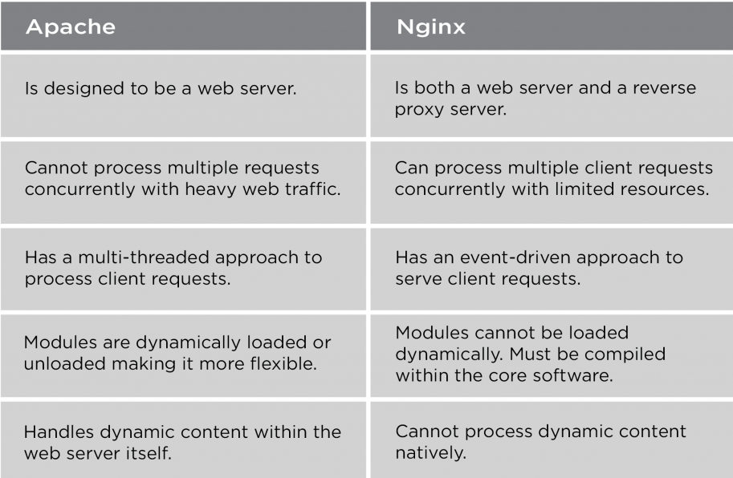

### LEPRETRE Guerric et SANDRAS Marine
_______
# Sujet 1 Mise en place

Se connecter à la machine de virtualisation: 
```
user@phys$ ssh prenom.nom.etu@nomMachine.iutinfo.fr
```

## 1. Simplifier la connection ssh
Pour éviter de taper notre mot de passe à chaque connection, on crée une clé qui sera reconnu par la machine de virtualisation.

On générera une clé public connu et une clé privée.

1. Générer une clée: 
```
user@phys$ ssh-keygen
```
On vous demandera un chemin pour le fichier de la clé puis une passphrase (un mot de passe) qui sera la clé privée.

2. Copier la clée publique générer dans autorized_key de la machine de virtualisation : 
```
user@phys$ ssh-copy-id (-i "cheminCleePublique") prenom.nom.etu@fnomMachine.iutinfo.fr
```

La première connection, suite à ceci, on vous demandera la clé privée et normalement aucun mot de passe et passphrase ne sera demander pendant les prochaines connections.

La clé sera utiliser à travers un agent ssh. Cette agent tourne en arrière plan pendant toute la durée de votre session.

## 2. Creer des vm

Il nous faut des commandes pour créer des vm, on va les chercher en tapant :
```
user@virtu$ source /home/public/vm/vm.env
```
*(Pour éviter de taper cette commande à chaque fois qu'on se connecte en ssh, on écrit cette commande dans le **.bashrc**)*

### Liste des commandes :

Créer la machine: 
```
user@virtu$ vmiut creer matrix
```
Afficher les vm: 
```
user@virtu$ vmiut lister
```
Démarrer une vm: 
```
user@virtu$ vmiut demarrer matrix
```
Arreter une vm: 
```
user@virtu$ vmiut arreter matrix
```
Supprimer une vm (la vm doit être arréter): 
```
user@virtu$ vmiut supprimer matrix
```
Info sur une vm: 
```
user@virtu$ vmiut info matrix
```

## 3. Configurer la vm
### Changer l'ip

*On ne peut pas faire de ssh pour changer l'ip !*
*On utilise ip pour se connecter donc on ne peut pas la désactiver*

Se connecter a la vm: 
```
user@virtu$ vmiut console matrix
```
Se mettre en root
```
user@vm$ su -
```
Désactiver l'ip
```
root@vm# ifdown ensp0s3
```
Configurer l'ip dans **/etc/network/interfaces** : 
```
iface ensp0s3 inet static
	address 192.168.194.3/24
	gateway 192.168.164.2
```
Redémarrer l'ip
```
root@vm# ifup ensp0s3
```
*(si il y a une erreur de ifup essayer ```ip add del 192.168.194.3/24 dev ensp0s3``` et refaire ```ifup ensp0s3```)*

### Configuration du proxy

Puisqu'il y a un proxy sur les machines de l'IUT, on doit le configurer pour que la vm puisse avoir accès à internet.

Le proxy étant **http://cache.univ-lille.fr:3128**.

Ajouter dans **/etc/environment**:
```
HTTP_PROXY=http://cache.univ-lille.fr:3128
HTTPS_PROXY=http://cache.univ-lille.fr:3128
http_proxy=http://cache.univ-lille.fr:3128
https_proxy=http://cache.univ-lille.fr:3128
NO_PROXY=localhost,192.168.194.0/24,172.18.48.0/22
```
*(NO_PROXY désigne les adresses n'ayant pas besoin du proxy)*

### Mise à jour

Mettre à jour tout les packets: 
```
root@vm# apt update && apt full-upgrade
```
*(Commande à effectuer de temps en temps)*
si une fenêtre s'ouvre cocher la case []/dev/sda (avec espace) et appuyer sur entrer.

Redémarrer la machine au cas où on a une nouvelle version du kernel
```
root@vm# reboot
```

### Installation de nouveaux packets

On installe des outils
```
root@vm# apt install vim less tree rsync
```

## 4. Aller plus loin

Pour éviter de taper tout l'adresse des machines en se connectant en ssh, on crée des alias dans le fichier **HOME/.ssh/config** :
```
Host virtu
		HostName nomMachine.iutinfo.fr
		User prenom.nom.etu

Host vm
		HostName 192.168.194.3
		User user
```

Pour se connecter directement en ssh à la vm de notre machine physique (donc sans passer par la machine de virtualisation).

On écrit dans le fichier dans le même fichier la ligne :
```
Host vmjump
        HostName 192.168.194.3
        User user
        ForwardAgent yes
        ProxyJump virtu
```

_______
# Sujet 2 Dernière configuration sur VM

## 1. Changer le nom de la VM
*(il faut être en root)*

La VM se nomme par défaut *debian* et on veut l'appeler *matrix*
```
Changer son nom dans le fichier **/etc/hostname** en replaçant *debian* par *matrix*.
```

Pour l'appeler par matrix en effectuant par exemple un **ping**
```
Changer le fichier **/etc/hosts** en replaçant *127.0.1.1   debian* par *127.0.1.1  matrix*.
```

## 2. Commande sudo

Pour installer la commande **sudo** :
```
root@vm# apt install sudo
```

On veut que user est accès à la commande **sudo**, on effectue :
```
root@vm# usermod -aG sudo user
```
*(-aG permet d'ajouter user au groupe sudo)*


Si on veut créer un autre user ayant accès à sudo, on fait :
```
root@vm# adduser user sudo
```

## 3. Configuration de l'horloge

En effectuant la commande **date** sur la vm, la machine de virtualisation et physique, on remarque que la vm est en avance d'un heure.

```
user@vm$ journalctl -u systemd-timesyncd
```
Cette commande permet de voir quand la vm a été créé et la dernière fois qu'elle a été démarré.

Pour arranger le problème d'heure, on modifie dans le fichier **/etc/systemd/timesyncd.conf** la ligne **NYP** :
```
NTP=ntp.univ-lille.fr
```
*(si vous êtes sur user n'oublier pas de mettre sudo avant la commande pour accèder au fichier)*

On redémarre le système pour que l'heure se règle :
```
user@vm$ sudo systemctl restart systemd-timesyncd.service
```
*ou*
```
root@vm$ systemctl restart systemd-timesyncd.service
```

## 4. Installation d'un serveur de base de donnée

On installe PostgreSQL :
```
user@vm$ sudo -E apt install postgresql
```
*(-E est pour préserver les configurations du proxy avec sudo)*

Vérifier l'état de postgreSQL :
```
user@vm$ systemctl status postgresql
```

S'y connecter :
```
user@vm$ sudo -u postgres psql
```

### Sur postgreSQL

Créer un utilisateur : 
```
postgres=# CREATE USER matrix WITH PASSWORD 'matrix';
```

Créer une base de donnée :
```
postgres=# CREATE DATABASE matrix;
```

Donner l'accès à matrix pour qu'il soit propriétaire de la base de donnée matrix :
```
postgres=# GRANT ALL privileges ON DATABASE matrix TO matrix;
```

### Sur le shell

On quitte postgreSQL pour retourner sur le shell d'user :
```
postgres=# \q
```

On va créer une table test dans la base de donnée matrix :
```
user@vm$ psql -h localHost -c "create table test(id int);" matrix matrix
```
*-h* demande le serveur qui est le localHost

*-c* demande la requète à éxécuter

*Le premier matrix* représente l'utilistaeur

*Le dernier matrix* représente la base de donnée

____________
# Sujet 3 Installation et configuration de Synapse

## 1. Accès à un service HTTP sur la VM
On installe un serveur HTTP sur la vm :

```
user@vm$ sudo -E apt install nginx
```
On vérifie qu'il est démarré avec la commande :
```
user@vm$ systemctl status nginx.service
```
On installe curl (un client HTTP) qui sert à ...
```
user@vm$ sudo -E apt install curl
```
On vérifie qu'on peut accéder au serveur **nginx** depuis la vm :
```
user@vm$ curl http://localhost
```

Vous devez obtenir ceci :
```HTML
<!DOCTYPE html>
<html>
<head>
<title>Welcome to nginx!</title>
<style>
    body {
        width: 35em;
        margin: 0 auto;
        font-family: Tahoma, Verdana, Arial, sans-serif;
    }
</style>
</head>
<body>
<h1>Welcome to nginx!</h1>
<p>If you see this page, the nginx web server is successfully installed and
working. Further configuration is required.</p>

<p>For online documentation and support please refer to
<a href="http://nginx.org/">nginx.org</a>.<br/>
Commercial support is available at
<a href="http://nginx.com/">nginx.com</a>.</p>

<p><em>Thank you for using nginx.</em></p>
</body>
</html>
```
--------------------
On essaye la même chose mais depuis la machine de virtualisation :
```
user@virtu$ curl --noproxy '*' http://192.168.194.3:80
```
Si on n'utilise pas le *noproxy* cela ne marche pas.
La vm est configurer pour ne pas passer par le proxy pour accèder au localhost, mais la machine de virtualisation est configurer pour passer par le proxy pour una adresse http. Le proxy ne connait pas la vm et ne peut donc pas le trouver.

--------------------
On veut maintenant accèder au service par notre machine physique.

*(Ce n'est pas posible directement puisque seul la machine de virtualisation connait et peut accèder au réseau de la vm)*

Pour ce faire, on doit utiliser la fonction tunnel de **ssh**. 

*(on tape la commande sur la machine de virtualisation)*
```
user@virtu$ ssh -L 0.0.0.0:9090:192.168.194.3:80 vm
```
*(vm est alias de user@192.168.194.3)*

On tape ensuite l'URL *http://machine-virtualisation.iutinfo.fr:9090* dans un navigateur de notre **machine physique**, et on accède au service de la vm. 
*machine-virtualisation* a remplacer par le nom de votre machine de virtualisation.

Pour éviter d'utiliser l'option **-L** à chaque fois, on écrit dans le fichier **.ssh/config** de la machine de virtualisation (rajouter les lignes dans l'host vm):
```
    LocalForward 0.0.0.0:9090 192.168.198.3:80
```

## 2. Installation de Synapse

### installation du paquet
Installation de paquet nécessaire pour synapse :
```
user@vm$ sudo -E apt install -y lsb-release wget apt-transport-https
```
Récupération du paquet de synapse :
```
user@vm$ sudo -E wget -O /usr/share/keyrings/matrix-org-archive-keyring.gpg https://packages.matrix.org/debian/matrix-org-archive-keyring.gpg
```

écrire dans un fichier les sources pour le paquet
```
user@vm$ echo "deb [signed-by=/usr/share/keyrings/matrix-org-archive-keyring.gpg] https://packages.matrix.org/debian/ $(lsb_release -cs) main" | sudo tee /etc/apt/sources.list.d/matrix-org.list
```
Faire une mise à jour du système
```
user@vm$ sudo -E apt update
```

installation de synapse :
```
user@vm$ sudo -E apt install matrix-synapse-py3
```
Pendant l'installation du packet un message vas apparaitre, il faut mettre machine_virtualisation.iutinfo.fr:8008 et valider. 
Mettre *non* pour la recuperation de donné pour améliorer le logiciel (ce n'est pas necéssaire pour notre vm).

### Paramétrage spécifique pour une instance dans un réseau privé

Les paramètres par défaut de Synapse considèrent que le serveur est accessible par internet et qu’il ne cherche pas à contacter des éléments situés sur un réseau privé, or ce réseau est privé.

dans **/etc/matrix-synapse/homeserver.yaml** modifier les dernières lignes
```
trusted_key_servers: 
    - serveur_name: "matrix.org"
```

changer en :
```
trusted_key_servers: []
```
*(supprimer le serveur_name)*

### Utilisation d’une base Postgres

Puisque Synapse utilise *sqlite* par défaut pour la base de donnée, on doit le configurer pour qu'il utilise postgreSQL à la place.

Modifier au fichier **/etc/matrix-synapse/homeserver.yaml** les lignes :
```
database:
  name: sqlite3
  args:
```
En :
```
database:
  name: psycopg2
  args:
    user: matrix
    password: matrix
    database: matrix
    host: localhost
    cp_min: 5
    cp_max: 10
```

La base de donnée "matrix" créée précédemment avait les options par défaut, elle doit être réécrite puisque Synapse ne les comprend pas.

Se connecter à PosgreSQL :
```
user@vm$  sudo su - postgres
```

Détruire l'ancienne base de donnée :
```
postgres@vm$ dropdb matrix;
```

Créer une base de donnée :
```
postgres@vm$ createdb --encoding=UTF8 --locale=C --template=template0 --owner=matrix matrix;
```
Quitter :
```
postgres@vm$ exit
```

On vérifie si la base PostgreSQL est utilisée par Synapse. Pour cela on redémarre Synapse:
```
user@vm$ sudo systemctl restart matrix-synapse.service
```
On regarde le contenu de la base de donnée matrix :
```
user@vm$ psql -h localhost -c "\d" matrix matrix
```
Tout est bon si il y a aucune erreur et qu'il y a un affichage de table comme celui-ci:
```
                              List of relations
 Schema |                      Name                      |   Type   | Owner
--------+------------------------------------------------+----------+--------
 public | access_tokens                                  | table    | matrix
 public | account_data                                   | table    | matrix
 public | account_data_sequence                          | sequence | matrix
 public | account_validity                               | table    | matrix
 public | application_services_state                     | table    | matrix
 public | application_services_txn_id_seq                | sequence | matrix
 public | application_services_txns                      | table    | matrix
```


### Création d’utilisateurs

Pour créer un utilisateur du serveur, il faut utiliser le script **register_new_matrix_user** et ajouter dans **/etc/matrix-synapse/homeserver.yaml** la ligne suivante, servant à partager la clé avec le script :
```
registration_shared_secret: "mdp"
```
On redémarre Synapse(commande vu précédemment)

On tape ensuite :
```
user@vm$ register_new_matrix_user -c /etc/matrix-synapse/homeserver.yaml
```
Puis on suit les instruction pour créer l'utilisateur.

### Connexion à votre serveur Matrix

On passe par un client element à l'adresse *http://tp.iutinfo.fr:8888* pour se connecter à notre serveur.
Sélectionner se connecter puis modifier le serveur d'accueil matrix.org par votre url de votre machine de virtualisation (*http://machine-virtualisation.iutinfo.fr:9090*).

Vous remarquerez qu'il ne trouve pas le serveur, c'est normal car l'url mène au serveur nginx configuré plus tôt.
Il faut changer la ligne *LocalForward* du fichier (de votre machine de virtualisation) **.ssh/config** de votre host vm avec :
```
LocalForward 0.0.0.0:9090 localhost:8008
```

Connecté vous à votre vm et le serveur d'accueil sera reconnu.
Connecté vous avec l'utilisateur créé plus tôt a votre serveur.

Vous atteignez l'interface de synapse et maintenant vous pouvez créer un salon pour discuter avec les utilisateur enregistrer sur votre serveur Synapse.

### Activation de l’enregistrement des utilisateurs 

Pour activer l'enregistration d'utilisateur non connu sans vérification, il faut rajouter les lignes suivant dans le fichier **/etc/matrix-synapse/homeserver.yaml**
```
enable_registration: true
enable_registration_without_verification: true
```

Il suffit de créer un nouveau compte, grâce à l'element web, en mettait le serveur visé.

_______
# Sujet 4 Installation et configuration de Element Web

## 1. Element Web

### A. Serveur Web
On doit choisir entre 2 serveur web pour exécuter Element :

- Apache 
.

- Nginx


On a choisie Apache puisqu'on le connait mieux et qu'on le préfère puisqu'il est facile et souple.


--------------
Installation :
```
user@vm$ sudo -E apt install apache2
```

Configuartion pour que l'Element soit accessible sur le port 8080 sur la vm.

Aller dans le fichier **/etc/apache2/ports.conf** pour remplacer :
```
Listen 80
```
En :
```
Listen 8080
```

Redirection ssh pour que le serveur web soit accessible sur le port 9090 de la machine de virtualisation :

Changer la ligne *LocalForward* du fichier (de votre machine de virtualisation) **.ssh/config** de votre host vm avec :
```
LocalForward 0.0.0.0:9090 localhost:8080
```

### B. Installation d'Element

```
user@vm:/var/www$ sudo -E wget https://github.com/vector-im/element-web/releases/download/v1.11.16/element-v1.11.16.tar.gz
```
```
user@vm:/var/www$ sudo tar -xf element-v1.11.16.tar.gz
```
### C. Configurer Element
2 méthodes pour accéder à Element :

- renommer *html* en *ancien* et renommer *element-v1.11.16* en *html* à l'emplacement **/var/www**

ou

- créer element.conf dans /etc/apache2/site-available :
    ```
    <VirtualHOST defaut:8080>
        Serveur_Admin webadmin@localhost
        DocumentRoot /var/www/element
        ErrorLog ${APACHE_LOG_DIR}/error-element.log
        CustomLog ${APACHE_LOG_DIR}/access-element.log combine
    </VirtualHOST>
    ```

puis faire cette commande suivante :
```
sudo a2ensite element.conf
sudo a2dissite 000-default.conf
```

____________________________

Dans le dossier contenant Element, copier le fichier *config.sample.json* en *config.json* :
```
user@vm$ sudo cp config.sample.json config.json
```
Puis dans le fichier config.json modifier la ligne
```
"base_url": "https://matrix-client.matrix.org",
```
En
```
"base_url": "https://machinevirtualisation.iutinfo.fr:9090",
```

## 2. Reverse Proxy pour Synapse

source: https://www.it-connect.fr/les-serveurs-proxy-et-reverse-proxy-pour-les-debutants/#III_Cest_quoi_un_reverse_proxy

À l'inverse du proxy, le reverse proxy comme son nom l'indique fonctionne à l'inverse, c'est-à-dire qu'il permet aux utilisateurs externes d'accéder à une ressource du réseau interne. Lorsque vous accédez à une ressource protégée par un reverse proxy, vous contactez le reverse proxy et c'est lui qui gère la requête, c'est-à-dire qu'il va contacter le serveur cible à votre place et vous retourner la réponse. Le client n'a pas de visibilité sur le ou les serveurs cachés derrière le reverse proxy. Le reverse proxy agit comme une barrière de protection vis-à-vis des serveurs du réseau interne, et il va permettre de publier la ressource de façon sécurisée.

### A. Introduction et choix

Il y a divers réverse proxy :


- Squid : c'est un proxy et reverse proxy qui n'est pas fait spécialement pour les serveur web mais pour la généralité.

- HAProxy : c'est le meilleur logiciel a utilisé pour les plateforme avec beaucoup de requète comme Twitter, GitHub ou Instagram.

- mod_proxy (Apache) : C'est une extension d'Apache.
- Nginx : Il fait serveur web et reverse proxy.

On décide de prendre l'extension d'Apache, puisque l'on connait apache et les deux premier cité ci-dessus sont pas necessaire pour notre petit serveur web avec peu de requètes.

### B. Installation

Activer le service proxy d'Apache
```
user@rproxy$ sudo a2enmod proxy proxy_http
```

Redémarrer Apache
```
user@rproxy$ sudo systemctl restart apache2.service
```

Créer le fichier matrix.conf dans */etc/apache2/sites-available/* et écrire dedans :
```
<VirtualHost *:80>
        ServerName frene11.iutinfo.fr
        ProxyRequests Off
        ProxyPass / http://192.168.194.3:8008/
        ProxyPassReverse / http://192.168.194.3:8008/
</VirtualHost>
```

Puis modifier dans */etc/apache2/mods-available/proxy.conf* :
```
        <Proxy http://frene11.iutinfo.fr:9090>
           AddDefaultCharset off
           Require all denied
        </Proxy>
```
_______
# Sujet 5

## Architecture final

Nous allons séparer les services d'Element, Synapse et PostgreSQL.
Pour se faire, on aura une vm **matrix** avec Synapse, **db** avec PostgreSQL et **element** avec Element.

> Tout d'abord on supprime et recrée matrix, on crée aussi db et element.
On les configure comme vu dans les sujet 1 et 2 :
- ip : 192.168.194.3 (matrix) | 192.168.194.5 (db) | 192.168.194.6 (element)
- configuration de l'environnement proxy de l'université
- installation d'outils
- donner l'accès *sudo* à *user*
- mise a jour de l'heure
- nom de l'host ("matrix" | "db" | "element")
- mise a jour général

> Dans le fichier **/etc/hosts** (de toute les vm) rajouter les adresses des autres vm, comme par exemple sur matrix :
```
127.0.0.1       localhost
127.0.1.1       matrix
192.168.194.4   rproxy
192.168.194.5   db
192.168.194.6   element
```

### Installation Synapse sur matrix

Réinstaller Synapse comme vu précédemment au sujet 3 avec les même configurations dans le fichier **homeserver.yaml** sauf :
> Pour les adresses
```
    blind_address: [::1, 127.0.0.1, 192.168.194.3]
```
> Pour l'host de la base de données, mettre l'adresse de la machine db
```
    host: 192.168.194.5
```
### Installation PostgreSQL sur db

Réinstaller PostgreSQL comme vu précédemment au sujet 2.
> Modifier le fichier **postgresql.conf** 
```
listen_addresses = '*'
```
> Et **pg_hba.conf**
``` 
# IPv4 local connections:
host     all      all    0.0.0.0/0   md5
### Installation Element sur element
```

> Recréer la base de données matrix avec son utilisateur matrix avec l'encodage (vu au sujet 3) pour que synapse comprend.

### Configuration d'Element sur element
Installer et configurer Element comme vu précédemment au sujet 4.

...

### Configuration de rproxy

...
